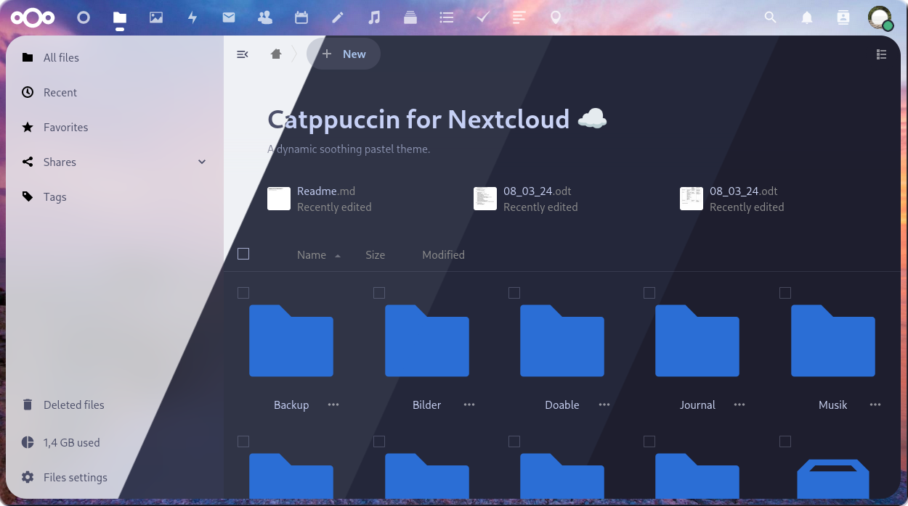
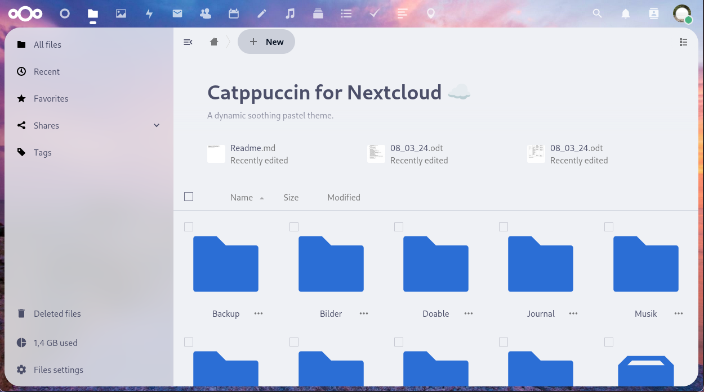
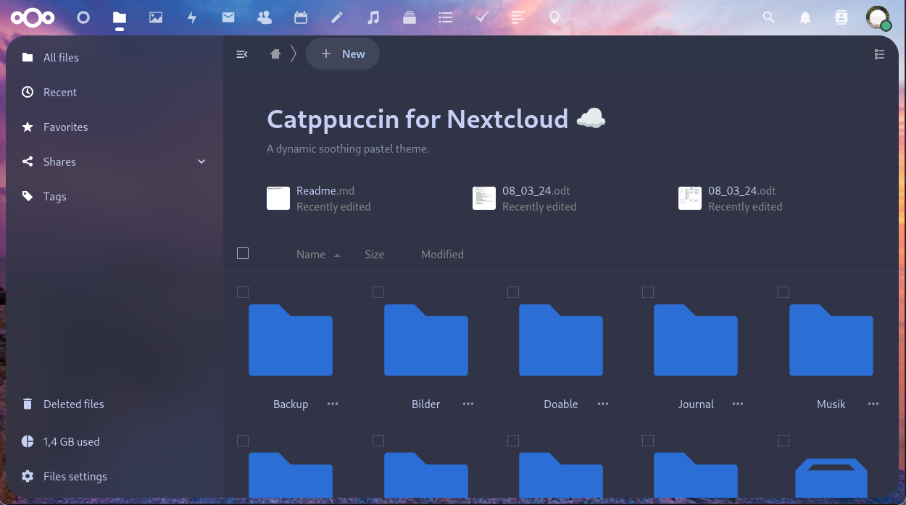
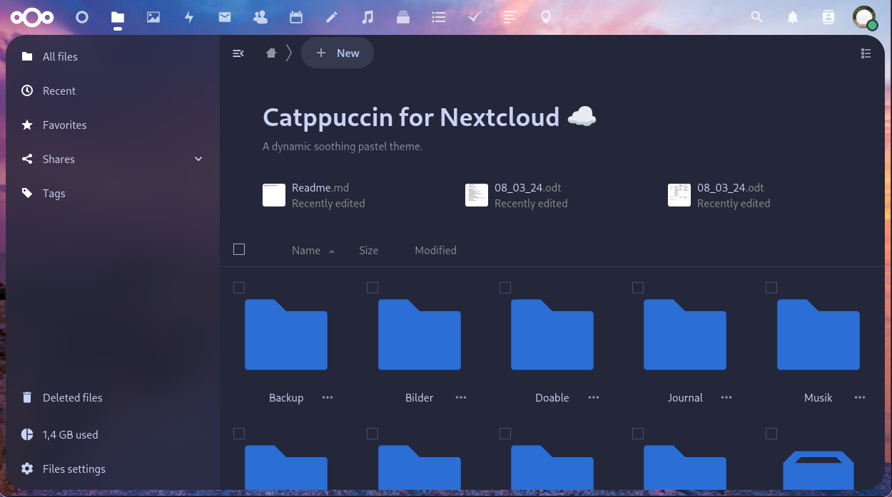
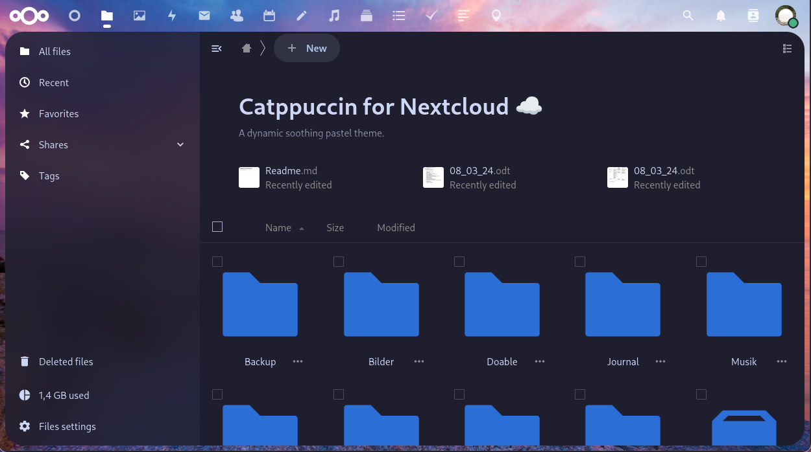

<h3 align="center">
	 
	
	Catppuccin for <a href="https://nextcloud.com/">Nextcloud</a>
	
</h3>

	
	
	

	

## Previews

🌻 Latte

🪴 Frappé

🌺 Macchiato

🌿 Mocha

## Usage

1. Copy the text of your desired variant from the source directory
2. Install the `Custom CSS` app in your Nextcloud instance
3. Open the settings page and navigate to `Theming`
4. Paste the code into the `Custom CSS` section
5. (If no change is visible) Under `Appearance & Accessibility`, select `System Default Theme`
6. Set the Nextcloud accent color to your [favorite color](https://github.com/catppuccin/catppuccin)

<!-- this section is optional -->
## 🙋 FAQ

-	Q: **_"What is meant by 'dynamic'?"_**\
	A: The palette will be your chosen flavor in dark mode, and Latte in light mode, according to the system theme.

## 💝 Thanks to

- [Motschen](https://github.com/Motschen)

&nbsp;

	

	Copyright &copy; 2021-present <a href="https://github.com/catppuccin" target="_blank">Catppuccin Org</a>

	

